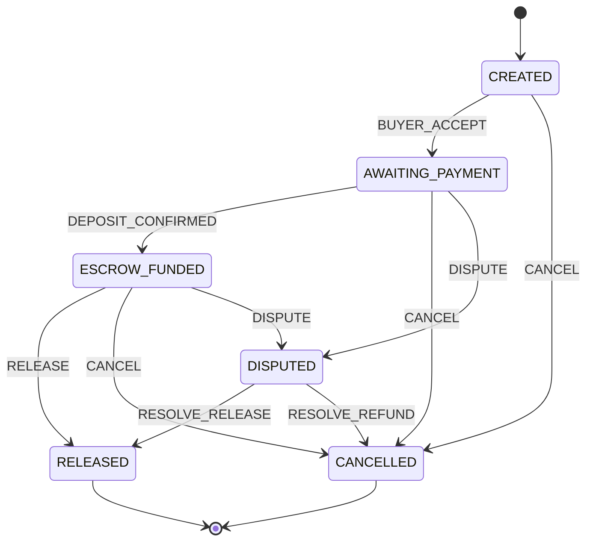

# Marketplace Domain Model — Order/Escrow Consistency

## 1) Domain Model

### Aggregate Root: Order

- **Order** is the only aggregate root. All escrow state and all transitions that touch money flow through the Order aggregate.
- **Escrow** is an entity (or value object) **inside** the Order aggregate boundary. It has no public identity outside the aggregate; it is loaded and saved only together with the Order.

### Invariants (must never break)

| Invariant | Rule |
|-----------|------|
| I1 | Order cannot be in a "paid" state (ESCROW_FUNDED / RELEASED) without an Escrow record. |
| I2 | Escrow cannot be RELEASED if Order is not RELEASED. |
| I3 | Escrow cannot be REFUNDED if Order is not CANCELLED. |
| I4 | Escrow cannot exist without an Order (foreign key + no creation outside aggregate). |
| I5 | Escrow amount and currency must equal Order amount and currency when escrow is funded. |
| I6 | Deposit events are processed **exactly once** (idempotency by key or by `order_id + tx_hash`). |

### Consistency rules

- No direct updates to the Escrow table from application code. All Escrow state changes go through Order domain methods.
- All transitions that change Order or Escrow run inside a single transaction with row locking (`SELECT FOR UPDATE` on Order and Escrow).
- Domain events are appended in the same transaction (outbox) and committed atomically.

---

## 2) State Machine Diagram

### Order states

```
CREATED → AWAITING_PAYMENT → ESCROW_FUNDED → RELEASED
    ↓            ↓                  ↓            (terminal)
 CANCELLED   CANCELLED          CANCELLED
    ↓            ↓                  ↓
 (terminal)  (terminal)         (terminal)

From ESCROW_FUNDED: → DISPUTED → RELEASED | CANCELLED
```

### Escrow states (inside Order)

```
PENDING → FUNDED → RELEASED
    ↓         ↓         (terminal)
 REFUNDED  REFUNDED
    ↓         ↓
 (terminal) (terminal)
```

### Legal transitions (Order)

| Current state     | Event                 | Next state    |
|-------------------|------------------------|---------------|
| CREATED           | BUYER_ACCEPT           | AWAITING_PAYMENT |
| CREATED           | CANCEL                 | CANCELLED     |
| AWAITING_PAYMENT  | DEPOSIT_CONFIRMED      | ESCROW_FUNDED |
| AWAITING_PAYMENT  | CANCEL                 | CANCELLED     |
| AWAITING_PAYMENT  | DISPUTE                | DISPUTED      |
| ESCROW_FUNDED     | RELEASE                | RELEASED      |
| ESCROW_FUNDED     | CANCEL                 | CANCELLED     |
| ESCROW_FUNDED     | DISPUTE                | DISPUTED      |
| DISPUTED          | RESOLVE_RELEASE        | RELEASED      |
| DISPUTED          | RESOLVE_REFUND         | CANCELLED     |

### Legal transitions (Escrow, applied only via Order)

| Order transition        | Escrow transition   |
|-------------------------|---------------------|
| → ESCROW_FUNDED         | PENDING → FUNDED    |
| → RELEASED              | FUNDED → RELEASED   |
| → CANCELLED             | FUNDED/PENDING → REFUNDED |

### Mermaid diagram



---

## 3) Deposit flow (transactional)

1. Blockchain deposit detected (webhook or poller).
2. Deposit event payload stored or identified (e.g. `order_id`, `tx_hash`, `amount`, `currency`, `idempotency_key`).
3. **Idempotency check**: if `idempotency_key` (or `order_id+tx_hash`) already processed → return success, no state change.
4. **Transaction opens** (begin).
5. **Load Order aggregate** with `SELECT FOR UPDATE` (order + escrow).
6. **Apply deposit event** in domain: validate amount/currency, transition Order AWAITING_PAYMENT → ESCROW_FUNDED, set Escrow PENDING → FUNDED, set `create_tx_hash`, `locked_at`.
7. **Persist** aggregate (order + escrow) and **idempotency record** in same transaction.
8. **Commit**.
9. **Emit domain event** (e.g. written to outbox/domain_events in same transaction so already committed).

---

## 4) Outbox

- Domain events are written to the `domain_events` table in the **same transaction** as the aggregate and idempotency row.
- A separate process can poll `domain_events` and publish to a message bus; once published, mark as processed or delete to avoid duplicate publishing.
